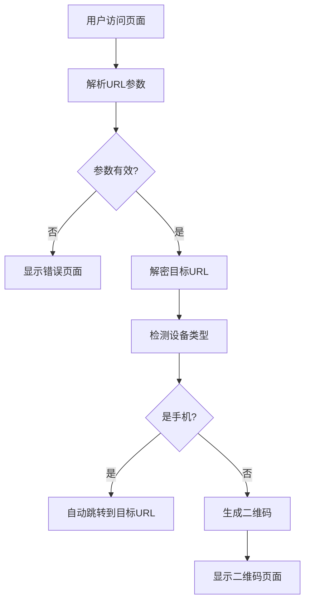

# Design Document

## Overview

本设计实现一个EdgeOne Pages静态网页，通过URL参数加密传递目标链接，根据设备类型自动跳转或显示二维码页面。整个系统采用纯前端实现，无需后端服务。

## Architecture



### 系统流程

1. 用户通过带参数的URL访问页面
2. JavaScript解析并解密URL参数
3. 检测用户设备类型（User-Agent）
4. 手机用户：自动302跳转到目标URL
5. 电脑/平板用户：显示二维码页面

## Components and Interfaces

### 1. URL参数处理模块 (UrlHandler)

```javascript
// URL参数格式: ?u=<encrypted_url>&n=<name>&c=<code>
// u: Base64编码的目标URL（必需）
// n: 资源名称（可选）
// c: 提取码（可选）

const UrlHandler = {
  // 加密URL（用于生成分享链接）
  encode(url) -> string,
  
  // 解密URL参数
  decode(encodedUrl) -> string | null,
  
  // 解析所有URL参数
  parseParams() -> { url: string, name: string, code: string }
}
```

### 2. 设备检测模块 (DeviceDetector)

```javascript
const DeviceDetector = {
  // 检测是否为手机设备
  isMobile() -> boolean,
  
  // 获取设备类型
  getDeviceType() -> 'mobile' | 'tablet' | 'desktop'
}
```

**检测逻辑**：
- 手机：包含 `iPhone`、`Android` 且不包含 `iPad`、`Tablet`
- 平板：包含 `iPad`、`Android.*Tablet`、`Tablet`
- 电脑：其他情况

### 3. 二维码生成模块 (QRCodeGenerator)

```javascript
// 使用 qrcode.js 库生成二维码
const QRCodeGenerator = {
  // 生成二维码到指定DOM元素
  generate(targetUrl, containerElement) -> void
}
```

### 4. 页面渲染模块 (PageRenderer)

```javascript
const PageRenderer = {
  // 渲染二维码页面
  renderQRPage(params) -> void,
  
  // 渲染错误页面
  renderErrorPage(message) -> void,
  
  // 执行跳转
  redirect(url) -> void
}
```

## Data Models

### URL参数结构

```typescript
interface UrlParams {
  u: string;    // Base64编码的目标URL（必需）
  n?: string;   // 资源名称（可选，默认"资源"）
  c?: string;   // 提取码（可选，默认"无"）
}
```

### 解析后的数据结构

```typescript
interface ParsedData {
  targetUrl: string;      // 解密后的目标URL
  resourceName: string;   // 资源名称
  extractCode: string;    // 提取码
  isValid: boolean;       // 参数是否有效
}
```

## Correctness Properties

*A property is a characteristic or behavior that should hold true across all valid executions of a system-essentially, a formal statement about what the system should do. Properties serve as the bridge between human-readable specifications and machine-verifiable correctness guarantees.*

### Property 1: URL编码解码往返一致性

*For any* 有效的URL字符串，对其进行Base64编码后再解码，应该得到与原始URL完全相同的字符串。

**Validates: Requirements 1.1, 1.2, 1.4**

### Property 2: 设备检测一致性

*For any* User-Agent字符串，设备检测函数应该返回确定的设备类型（mobile/tablet/desktop），且多次调用结果一致。

**Validates: Requirements 2.1, 2.4, 2.5**

### Property 3: 手机设备必定跳转

*For any* 被识别为手机设备的访问，且URL参数有效时，系统必定执行跳转操作而非显示二维码页面。

**Validates: Requirements 2.2**

### Property 4: 非手机设备必定显示二维码

*For any* 被识别为电脑或平板设备的访问，且URL参数有效时，系统必定显示二维码页面而非执行跳转。

**Validates: Requirements 2.3, 3.1**

### Property 5: 无效参数必定显示错误

*For any* 缺失必需参数或解密失败的访问，系统必定显示错误提示页面。

**Validates: Requirements 1.3**

## Error Handling

### 错误场景

| 错误类型 | 处理方式 |
|---------|---------|
| URL参数缺失 | 显示"链接无效"错误页面 |
| Base64解码失败 | 显示"链接已损坏"错误页面 |
| 二维码生成失败 | 显示备用文本链接 |

### 错误页面设计

```html
<div class="error-container">
  <h2>链接无效</h2>
  <p>请检查链接是否完整或联系分享者重新获取</p>
</div>
```

## Testing Strategy

### 单元测试

1. **URL编码解码测试**
   - 测试普通URL编码解码
   - 测试包含特殊字符的URL
   - 测试空字符串处理
   - 测试无效Base64字符串

2. **设备检测测试**
   - 测试iPhone User-Agent
   - 测试Android手机 User-Agent
   - 测试iPad User-Agent
   - 测试桌面浏览器 User-Agent

### 属性测试

使用 fast-check 库进行属性测试：

1. **Property 1**: URL往返测试 - 生成随机URL字符串，验证编码解码一致性
2. **Property 2**: 设备检测确定性 - 生成随机User-Agent，验证结果一致性

### 集成测试

1. 完整流程测试：参数解析 → 设备检测 → 页面渲染/跳转
2. 错误流程测试：无效参数 → 错误页面显示
